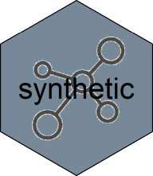

---
output:
  github_document
editor_options: 
  chunk_output_type: console
---

<!-- README.md is generated from README.Rmd. Please edit that file -->

```{r, echo = FALSE}
knitr::opts_chunk$set(
  collapse = TRUE,
  comment = "#>",
  fig.path = "README-"
)
```



[](https://travis-ci.org/fstpackage/synthetic)
[](https://ci.appveyor.com/project/fstpackage/synthetic/branch/develop)
[](https://www.gnu.org/licenses/agpl-3.0)
[](https://www.tidyverse.org/lifecycle/#experimental)
[](https://codecov.io/gh/fstpackage/synthetic)

## Overview

```{r, echo = FALSE}
set.seed(87617)
```

The `synthetic` package provides tooling to greatly symplify the creation of synthetic datasets for testing purposes. It's features include:

* Creation of _dataset templates_ that can be used to generate arbitrary large datasets
* Creation of _column templates_ that can be used to define column data with custom range and distribution
* Automatic creation of dataset templates from existing datasets
* Many pre-defined templates to help you generate synthetic datasets with little effort
* Extented benchmark framework to help test the performance of serialization options such as `fst`, `arrow`, `fread` / `fwrite`, `sqlite`, etc.

By using a standardized method of serialization benchmarking, benchmark results become more reliable and more easy to compare over various solutions, as can be seen further down in this introduction.

## Synthetic datasets

Most `R` users will probably be familiar with the _iris_ dataset as it's widely used in package examples and tutorials:

```{r, message = FALSE}
library(dplyr)

iris %>%
  as_tibble()
```

But what if you need a dataset of a million rows? The `synthetic` package makes that straightforward. Simply define a _dataset template_ using `synthetic_table()`:

```{r}
library(synthetic)

# define a synthetic table
synt_table <- synthetic_table(iris)
```

and generate a custom number of rows:

```{r}
synt_table %>%
  generate(1e6) # a million rows
```

You can also select specific columns:

```{r}
synt_table %>%
  generate(1e6, "Species")  # single column
```

## Building templates from existing datasets


## Benchmarking serialization

Benchmarks performed With `synthetic` have the following features:

* Each measurement of serialization speed uses a unique dataset (_avoid disk caching_)
* A read is not executed immediately after a write of the same dataset  (_avoid disk caching_)
* All (column-) data is generated on the fly using predefined generators (_no need to download large test sets_)
* A wide range of data profiles can be used for the creation of synthetic data (_understand dependencies on data format and profile_)
* Object- en file sizes are recorded and speeds automatically calculated (_reproducible results_)
* A progress bar shows percentage done and time remaining (_know when to go and get a cup of coffee_)
* Only the actual serialization speed is benchmarked (_measure only what must be measured_)
* Multithreaded solutions are correctly measured (_unlike some benchmark techniques_)

But most importantly, with the use of `synthetic`, complex benchmarks are reduced to a few simple statements, increasing your productivity and reproducibility!


## Walkthrough: setting up a benchmark

A lot of claims are made on the performance of serializers and databases, but the truth is that all solutions have their own strenghts and weaknesses.

_some more text here_

Define the template of a test dataset:

```{r, eval = FALSE}
library(synthetic)
library(fst)
library(arrow)

# generator for 'fst benchmark' dataset
generator <- table_generator(
  "fst benchmark",
  function(nr_of_rows) {
    data.frame(
      Logical = sample_logical(nr_of_rows, true_false_na_ratio = c(85, 10, 5)),
      Integer = sample_integer(nr_of_rows, max_value = 100L),
      Real    = sample_integer(nr_of_rows, 1, 10000, max_distict_values = 20) / 100,
      Factor  = as.factor(sample(labels(UScitiesD), nr_of_rows, replace = TRUE))
    )}
)
```

Do some benchmarking on the _fst_ format:

```{r, eval = FALSE}
library(dplyr)

synthetic_bench() %>%
  bench_generators(generator) %>%
  bench_streamers(streamer_fst()) %>%
  bench_rows(1e7) %>%
  collect()
```

Congratulations, that's your first structured benchmark :-)

Now, let´s add a second _streamer_ and allow for two different sizes of datasets:

```{r, eval = FALSE}
synthetic_bench() %>%
  bench_generators(generator) %>%
  bench_streamers(streamer_fst(), streamer_parguet()) %>%  # two streamers
  bench_rows(1e7, 5e7) %>%
  collect()
```

As you can see, although benchmarking two solutions at different sizes is more complex than the single solution benchmark, with `synthetic` it´s just a matter of expanding some of the arguments.

Let´s add two more _streamers_ and add compression settings to the mix:

```{r, eval = FALSE}
synthetic_bench() %>%
  bench_generators(generator) %>%
  bench_streamers(streamer_rds(), streamer_fst(), streamer_parguet(), streamer_feather()) %>%
  bench_rows(1e7, 5e7) %>%
  bench_compression(50, 80) %>%
  collect()
```
