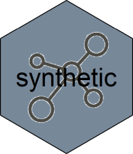

<!-- README.md is generated from README.Rmd. Please edit that file -->



[](https://travis-ci.org/fstpackage/synthetic)
[](https://ci.appveyor.com/project/fstpackage/synthetic)
[](https://www.gnu.org/licenses/agpl-3.0)
[](https://www.tidyverse.org/lifecycle/#experimental)
[](https://codecov.io/gh/fstpackage/synthetic)

## Overview

The `synthetic` package provides tooling to greatly symplify the
creation of synthetic datasets for testing purposes. It’s features
include:

  - Creation of *dataset templates* that can be used to generate
    arbitrary large datasets
  - Creation of *column templates* that can be used to define column
    data with custom range and distribution
  - Automatic creation of dataset templates from existing datasets
  - Many pre-defined templates to help you generate synthetic datasets
    with little effort
  - Extented benchmark framework to help test the performance of
    serialization options such as `fst`, `arrow`, `fread` / `fwrite`,
    `sqlite`, etc.

By using a standardized method of serialization benchmarking, benchmark
results become more reliable and more easy to compare over various
solutions, as can be seen further down in this introduction.

## Synthetic datasets

Most `R` users will probably be familiar with the *iris* dataset as it’s
widely used in package examples and tutorials:

``` r
library(dplyr)

iris %>%
  as_tibble()
#> # A tibble: 150 x 5
#>    Sepal.Length Sepal.Width Petal.Length Petal.Width Species
#>           <dbl>       <dbl>        <dbl>       <dbl> <fct>  
#>  1          5.1         3.5          1.4         0.2 setosa 
#>  2          4.9         3            1.4         0.2 setosa 
#>  3          4.7         3.2          1.3         0.2 setosa 
#>  4          4.6         3.1          1.5         0.2 setosa 
#>  5          5           3.6          1.4         0.2 setosa 
#>  6          5.4         3.9          1.7         0.4 setosa 
#>  7          4.6         3.4          1.4         0.3 setosa 
#>  8          5           3.4          1.5         0.2 setosa 
#>  9          4.4         2.9          1.4         0.2 setosa 
#> 10          4.9         3.1          1.5         0.1 setosa 
#> # ... with 140 more rows
```

But what if you need a dataset of a million rows? The `synthetic`
package makes that straightforward. Simply define a *dataset template*
using `synthetic_table()`:

``` r
library(synthetic)

# define a synthetic table
synt_table <- synthetic_table(iris)
```

and generate a custom number of rows:

``` r
synt_table %>%
  generate(1e6) # a million rows
#> # A tibble: 1,000,000 x 5
#>    Sepal.Length Sepal.Width Petal.Length Petal.Width Species   
#>           <dbl>       <dbl>        <dbl>       <dbl> <fct>     
#>  1          5.1         2.5          3           1.1 versicolor
#>  2          5.7         3            4.2         1.2 versicolor
#>  3          6.8         2.8          4.8         1.4 versicolor
#>  4          5           3.5          1.6         0.6 setosa    
#>  5          5.6         2.8          4.9         2   virginica 
#>  6          5.4         3.7          1.5         0.2 setosa    
#>  7          6.4         3.2          5.3         2.3 virginica 
#>  8          6.5         3            5.2         2   virginica 
#>  9          4.6         3.4          1.4         0.3 setosa    
#> 10          6.9         3.1          5.4         2.1 virginica 
#> # ... with 999,990 more rows
```

You can also select specific columns:

``` r
synt_table %>%
  generate(1e6, "Species")  # single column
#> # A tibble: 1,000,000 x 1
#>    Species   
#>    <fct>     
#>  1 versicolor
#>  2 virginica 
#>  3 versicolor
#>  4 setosa    
#>  5 versicolor
#>  6 setosa    
#>  7 versicolor
#>  8 versicolor
#>  9 versicolor
#> 10 virginica 
#> # ... with 999,990 more rows
```

## Building templates from existing datasets

## Benchmarking serialization

Benchmarks performed With `synthetic` have the following features:

  - Each measurement of serialization speed uses a unique dataset
    (*avoid disk caching*)
  - A read is not executed immediately after a write of the same dataset
    (*avoid disk caching*)
  - All (column-) data is generated on the fly using predefined
    generators (*no need to download large test sets*)
  - A wide range of data profiles can be used for the creation of
    synthetic data (*understand dependencies on data format and
    profile*)
  - Object- en file sizes are recorded and speeds automatically
    calculated (*reproducible results*)
  - A progress bar shows percentage done and time remaining (*know when
    to go and get a cup of coffee*)
  - Only the actual serialization speed is benchmarked (*measure only
    what must be measured*)
  - Multithreaded solutions are correctly measured (*unlike some
    benchmark techniques*)

But most importantly, with the use of `synthetic`, complex benchmarks
are reduced to a few simple statements, increasing your productivity and
reproducibility\!

## Walkthrough: setting up a benchmark

A lot of claims are made on the performance of serializers and
databases, but the truth is that all solutions have their own strenghts
and weaknesses.

*some more text here*

Define the template of a test dataset:

``` r
library(synthetic)
library(fst)
library(arrow)

# generator for 'fst benchmark' dataset
generator <- table_generator(
  "fst benchmark",
  function(nr_of_rows) {
    data.frame(
      Logical = sample_logical(nr_of_rows, true_false_na_ratio = c(85, 10, 5)),
      Integer = sample_integer(nr_of_rows, max_value = 100L),
      Real    = sample_integer(nr_of_rows, 1, 10000, max_distict_values = 20) / 100,
      Factor  = as.factor(sample(labels(UScitiesD), nr_of_rows, replace = TRUE))
    )}
)
```

Do some benchmarking on the *fst* format:

``` r
library(dplyr)

synthetic_bench() %>%
  bench_generators(generator) %>%
  bench_streamers(streamer_fst()) %>%
  bench_rows(1e7) %>%
  collect()
```

Congratulations, that’s your first structured benchmark :-)

Now, let´s add a second *streamer* and allow for two different sizes of
datasets:

``` r
synthetic_bench() %>%
  bench_generators(generator) %>%
  bench_streamers(streamer_fst(), streamer_parguet()) %>%  # two streamers
  bench_rows(1e7, 5e7) %>%
  collect()
```

As you can see, although benchmarking two solutions at different sizes
is more complex than the single solution benchmark, with `synthetic`
it´s just a matter of expanding some of the arguments.

Let´s add two more *streamers* and add compression settings to the mix:

``` r
synthetic_bench() %>%
  bench_generators(generator) %>%
  bench_streamers(streamer_rds(), streamer_fst(), streamer_parguet(), streamer_feather()) %>%
  bench_rows(1e7, 5e7) %>%
  bench_compression(50, 80) %>%
  collect()
```
